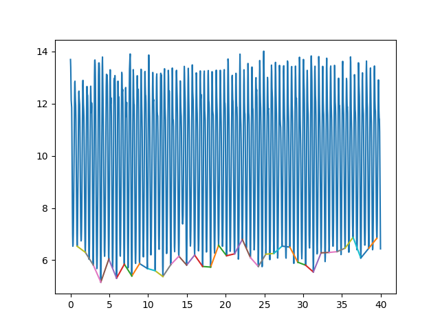

# cycle detection
This work is followed by Derawi, Mohammad O., Patrick Bours, and Kjetil Holien. “Improved Cycle Detection for
Accelerometer Based Gait Authentication,” 312–17. IEEE, 2010. https://doi.org/10.1109/IIHMSP.2010.84.

## usage
+ prepare your data
    + prepare a good walking samples without any interruption
    + a suggested format is in `./test_data.csv`
+ open actions.py
    + set `ROOT` to root of your data set, default is '.'
    + set `SAMPLE_RATE` to the sample rate declared by author of data set you use, default is 'test_data.csv'
    + set `SUBSET_SIZE` near to count of samples when people walk slowly
    + set `file_path` to relative path of your data file  
__NOTICE__: the `SAMPLE_RATE` and `SUBSET_SIZE` are very important!
+ update `get_data(file_path)`
+ find `6 Remove odd cycles` and you can get indices detected
    + uncomment `show` to see the performance
    
+ find `7 Get splitted data` and you can store them if you want
