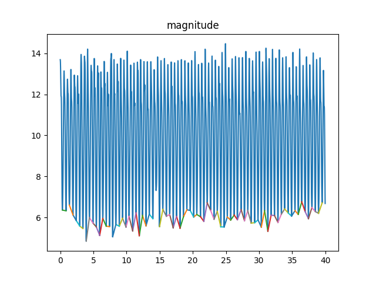
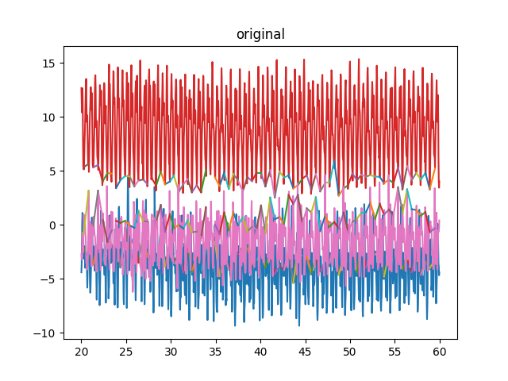
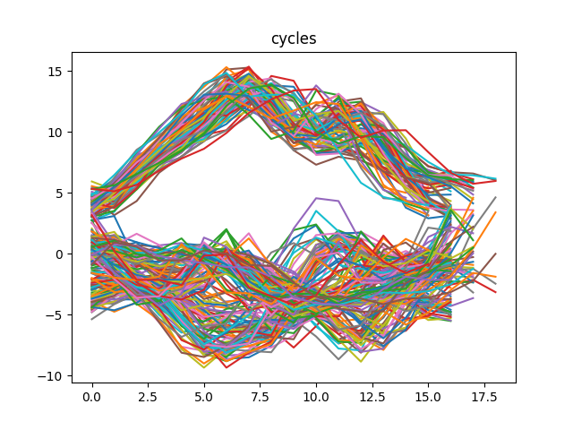

# cycle detection

This work is followed by Derawi, Mohammad O., Patrick Bours, and Kjetil Holien. “Improved Cycle Detection for
Accelerometer Based Gait Authentication,” 312–17. IEEE, 2010. https://doi.org/10.1109/IIHMSP.2010.84.

## usage

+ prepare your data in good format
    + prepare a good walking samples without any interruption
    + a suggested format is in `./test_data`
    + don't add any extension name  to the file, like `.csv`

+ log
```
>>> file name: ./test_data
>>> cycle length old way 102.0 new 50
>>> serial length: 3997
>>> cycle_length: 50
>>> offset: 5
>>> interval: 3
>>> search start from 1858(old), 2013(new)
>>> search summary: start 2013 end 2060
...
>>> search summary: start 3896 end 3951
>>> search summary: done, last start from 3951
>>> search summary: start 2013 end 1960
...
>>> search summary: start 88 end 32
>>> search summary: done, last start from 3964
>>> remove cycle [1445, 1498]
>>> remove cycle [1397, 1445]
>>> remove cycle [744, 791]
>>> remove cycle [342, 392]
>>> remove cycle [88, 138]
>>> save pic: results/original
>>> save pic: results/magnitude
>>> save pic: results/cycles
```

+ results


    

    

